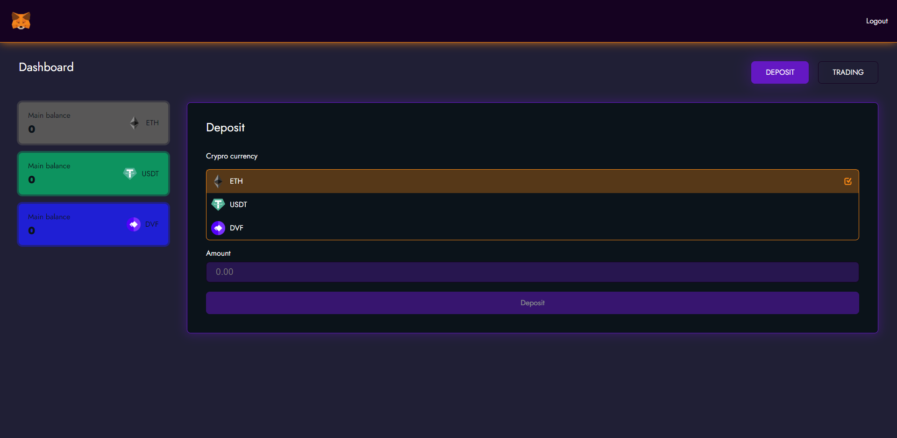

# STARTUP CREATION CHECKLIST

# Instructions

One time limited task which was done for a job interview, it was for a frontend part but I did the full stack requirement.
It was one under 8 hours for both.

## Requirements:

- Sign in with Metamask wallet using web3 library’s personal sign method
- Trading view

  > Once a user is authenticated, they should be able to:

  - deposit funds
  - submit orders
  - see their deposited funds and placed orders.

- Deposit view
  - User is shown a form where they can input an amount and select one of these tokens (ETH, USDT, DVF)
  - The deposit is submitted to the API (see below)
  - User can see their deposited balances (token / amount)

## System Requirements

- Node.js 12.22.0 or later
- MacOS, Windows (including WSL), and Linux are supported

## Instaling the dependencies

- be sure to have Node.js instaled `https://nodejs.org/en/`
- start the `cmd` of you choosing and navigate to the project folder
- type `yarn install` or `npm install`

## Starting the server

- Run `npm run dev` or `yarn dev` to start the development server on `http://localhost:3000`
- Visit `http://localhost:3000` to view your application
